# Chapter 7: Solution-Neutral Function and Concepts

**『Systems Architecture: Strategy and Product Development for Complex Systems』輪読用まとめ（レビュー反映版）**

**対象:** Chapter 7, pp.151-172（アップロードPDF収録範囲。Section 7.6 Summary の途中まで）  
**注:** 図表は元PDFから切り出し、`figures/` 以下に配置している。

---

## 0. この章の位置づけ

これまでの章では、すでに存在するシステムを対象として、

- システムが何で構成されているか
- 各構成要素がどのような機能を持つか
- **form（形態）** と **function（機能）** がどのように対応しているか

を理解する **reverse engineering** を中心に扱ってきた。

第7章からは、stakeholder の要求から新しいシステムを作る **forward engineering** に移る。

本章の大きな流れは次のように整理できる。

1. Stakeholder / beneficiary の **Need / Intent** を把握する
2. 解決方法を含まない **Solution-Neutral Function** を定義する
3. それを実現する複数の **Concept** を考える
4. 選択した Concept の process が意味の豊かなものである場合は、必要に応じて internal processes へ展開し、**Integrated Concept** を構成する
5. システムやサービスが実際にどのように運用されるかを **Concept of Operations（ConOps、運用構想）** として整理する
6. 次章で Architecture の設計へ進む

第7章冒頭の Table 7.1 では、この forward engineering で検討すべき質問が整理されている。

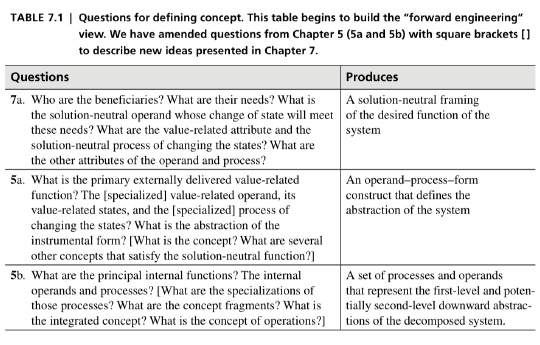

*Table 7.1, 書籍 p.152*

---

# 1. Solution-Neutral Function

## 1.1 Solution-Neutral Function とは

**Solution-Neutral Function** とは、**その機能をどのように実現するかを含めずに記述したシステムの機能**である。

つまり、特定の製品・技術・構造を前提にしない機能記述である。

本章では、ワインボトルのコルクを取り除くシステムが最初の例として使われる。

最初から「コルクスクリューでコルクを引き抜く」と考えると、すでに

- **screw** という instrument
- **pulling** という process

を解決策として選んでしまっている。

そこで、より solution-neutral に **cork translating（コルクを移動させる）** と記述する。

すると、例えば

- Pushing
- Shearing
- Pulling

といった異なる specific process を候補にできる。

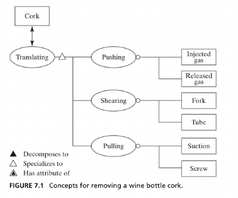

*Figure 7.1, 書籍 p.152*

### ポイント

Solution-Neutral Function の狙いは、設計の初期段階で solution を埋め込んだ表現によって候補を狭めないことである。

「コルクを抜く = 引っ張る」と決めつけず、「コルクを移動させる」という一段抽象的な表現にすることで、**最初に思いついた solution へ固定されるリスクを減らし、より広い concept space を探索しやすくする**。

---

## 1.2 Solution-Neutral Function にも階層がある

「コルクを移動させる」よりさらに上位の目的を考えると、そもそも目的は **ワインにアクセスすること**である。

そのため、解決策の候補はコルクを取り除くことだけではなく、ボトルそのものを破るなど、さらに広く考えることができる。

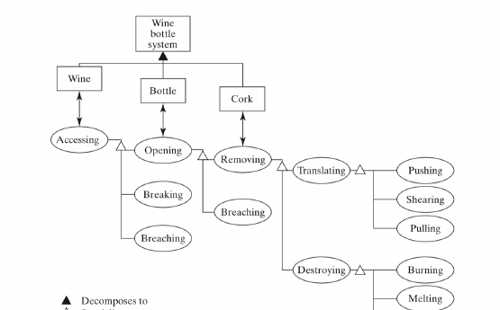

*Figure 7.2, 書籍 p.154*

この図が示している重要な点は、**どのレベルを Solution-Neutral Function として扱うかは一意ではない**ということである。

設計対象を狭く捉えれば「コルクを移動させる」が機能になるが、より上位から見れば「ワインにアクセスする」が機能になる。

---

# 2. Solution-Neutral Function の導出

## 2.1 Stakeholder の Need から考える

Solution-Neutral Function は、システムそのものからではなく、**beneficiary（便益を受ける主体）の Need** から導出する。

本節では説明を単純化するため、主に **primary beneficiary の primary need** から導かれる functional intent に焦点を当てている。実際には他の stakeholders や secondary value に基づく goals も存在し、それらを含む包括的な goal の検討は後の章で扱われる。

本章では概ね次の順序で整理している。

1. **Beneficiary** を特定する
2. Beneficiary の **Need** を特定する
3. Need を満たすために変化させる **solution-neutral operand** を決める
4. operand のうち、価値に直接関係する **benefit-related attribute** を決める
5. 必要に応じて、その他の重要な operand attribute を特定する
6. benefit-related attribute を変化させる **solution-neutral process** を決める
7. 必要に応じて、process の重要な attribute を特定する

ここでは function を大まかに、**operand（何に対して） + process（何をするか）** として捉えている。

---

## 2.2 Transportation Service と Home Network の例

Table 7.2 では、Transportation Service と Home Network について Solution-Neutral Function を導出している。

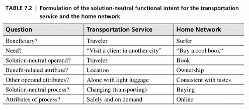

*Table 7.2, 書籍 p.155*

### Transportation Service

- Beneficiary: Traveler
- Need: 別の都市にいる顧客を訪問する
- Solution-neutral operand: Traveler
- Benefit-related attribute: Location
- Other operand attribute: Alone with light luggage
- Solution-neutral process: Changing / transporting
- Process attribute: Safely and on demand

本質的な要求は、**Traveler の location を変更すること**である。

この段階では、airplane、train、car といった具体的な交通手段は含めない。

### Home Network

- Beneficiary: Surfer
- Need: Buy a cool book
- Solution-neutral operand: Book
- Benefit-related attribute: Ownership
- Other operand attribute: Consistent with tastes
- Solution-neutral process: Buying
- Process attribute: Online

ここでも「DSLを使う」「Wi-Fiを使う」といった技術から始めるのではなく、利用者の intent である **book を online で buy する**ことから考えている。

---

## 2.3 Intent は完成したシステムからは見えにくい

システムが実際に完成してしまうと、元々どのような Need / Intent からそのシステムが生まれたのかは見えにくくなる。

例えば飛行機を見れば「人を飛ばす」という機能は推測できるが、「別の都市にいる顧客を訪問したい」という元の intent までは分からない。

そのため forward engineering では、**具体的な form を決める前に intent を明示すること**が重要になる。

---

# 3. Concept

## 3.1 Concept とは

理解のために大まかに単純化すると、Solution-Neutral Function は **「何を実現したいか」**、Concept は **「どのような方式で実現するか」** に対応すると考えられる。

ただし、これは説明上の単純化であり、本書における Concept は単なる「How」だけではない。

本書では Concept を、**function を form へ対応づける product / system の vision, idea, notion, mental image** として定義している。Concept には specific operand、specific process、form（instrument）と、それらの attributes が含まれる。

Concept はまだ詳細な Architecture ではなく、function と form を高い抽象度で結び付ける system vision である。

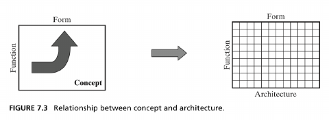

*Figure 7.3, 書籍 p.157*

Figure 7.3 では、Concept が function と form を大まかに結び付けるのに対し、Architecture では多数の function と form の対応関係をより詳細に定義することが示されている。

また Concept を選ぶことで、システム設計で用いる **solution vocabulary**、主要な **design parameters**、さらに暗黙には **technology level** もある程度定まる。例えば centrifugal pump という Concept を選ぶと、motor、housing、impeller といった語彙や、impeller speed、pressure rise といった設計パラメータが自然に現れる。

---

## 3.2 Solution-Neutral Function から Concept へ

Concept を作る際には、Solution-Neutral Function を段階的に具体化する。

Figure 7.4 はその基本フレームワークを示している。

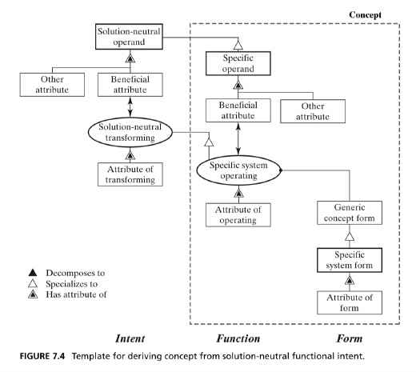

*Figure 7.4, 書籍 p.158*

大きく見ると、次の具体化が行われる。

- Solution-neutral operand → **Specific operand**
- Solution-neutral process → **Specific operating process**
- operating process を実現する → **Generic concept form**
- Generic concept form → **Specific system form**

さらに Figure 7.4 では、Concept の記述に

- beneficial attribute
- other operand attribute
- process attribute
- form attribute

も含まれることが示されている。

したがって Concept は、単に「operand / process / form」という3つの名称の組合せではなく、**それらの属性まで含めた高水準の function-form mapping** として表現できる。

---

## 3.3 Specialization は機械的な一対一変換ではない

Table 7.3 では、5つのシステムについて Solution-Neutral Function と solution-specific Concept の関係を比較している。

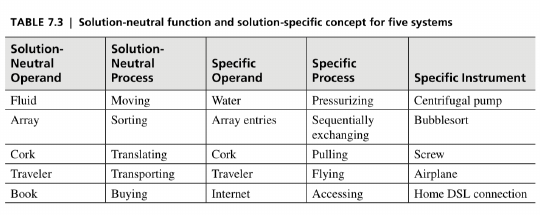

*Table 7.3, 書籍 p.158*

Transportation Service では、

- Solution-neutral operand: Traveler
- Solution-neutral process: Transporting
- Specific operand: Traveler
- Specific process: Flying
- Specific instrument: Airplane

となる。

一方、pump では、solution-neutral な **Fluid / Moving** が specific な **Water / Pressurizing** に specialize され、その specific instrument として **Centrifugal pump** が対応付けられる。

ここから分かる重要な点は、**Solution-Neutral Function から Concept への specialization は一種類の機械的な変換ではない**ということである。

Box 7.3 では、specific operand が例えば次のような関係になり得ることが示されている。

- solution-neutral operand とは異なる operand
- 元の operand の一部
- 元の operand の一種
- 元の operand の attribute
- 元の operand の attribute を記述する information object

process についても、別の process を選ぶ、一種へ具体化する、attribute を加えて具体化する、など複数の specialization があり得る。

また、`pulling` のような **specific process だけでは Concept 全体を表したことにはならない**。例えばコルクの例なら、`cork / pulling / screw` のように operand、process、instrument / form の対応まで含めて Concept と考える。

---

## 3.4 Attributes を含む Concept の記述

Table 7.4 は、Figure 7.4 の枠組みに沿って Transportation Service と Home Network の Concept をより完全に記述した例である。

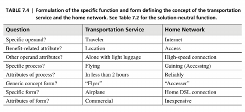

*Table 7.4, 書籍 p.160*

例えば Transportation Service の Concept は、要約すると、**軽い荷物を持つ一人の Traveler を、commercial airplane によって2時間未満で flying する**という一つの文として表せる。

Home Network では、**high-speed Internet connection へ reliably accessing するために inexpensive な home DSL connection を用いる**という Concept になる。

この例から、Concept が specific process や instrument の名前だけではなく、operand / process / form とそれぞれの attributes を合わせて記述されることが分かる。

---

## 3.5 Concept の命名

Concept には統一された命名規則はない。理想的には operand + process + instrument を含めれば情報量が多いが、実際の名称にはその一部しか現れない場合も多い。

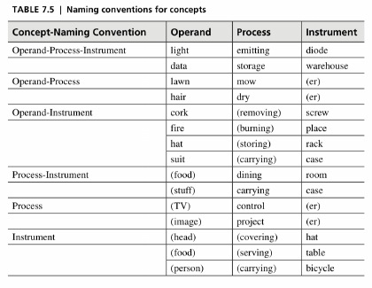

*Table 7.5, 書籍 p.161*

したがって、**Concept の名称だけから、その Concept が持つ operand / process / form の全体を判断しないこと**が重要である。

---

# 4. Concept の候補を広げる

## 4.1 Concept は一つではない

Solution-Neutral Function に対して、最初に思いついた Concept をそのまま採用するのではなく、複数の alternative concept options を生成する。

Figure 7.5 は、同じ Solution-Neutral Function から複数の **specific operating process** を分岐させ、さらに generic form と specific form を対応付けることで、複数の Concept を構成する考え方を示している。

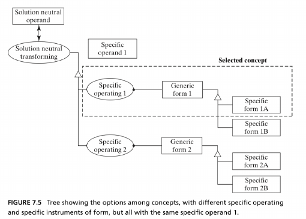

*Figure 7.5, 書籍 p.162*

ここで重要なのは、**specific operating process 単独を Concept と呼ぶのではなく、specific operand / process と form の対応まで含めて Concept と考える**ことである。

---

## 4.2 Pump の例

Figure 7.6 では、solution-neutral function である **Fluid / Moving** から複数の Concept 候補を展開している。

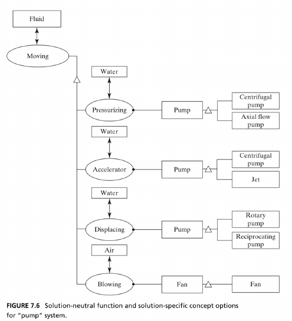

*Figure 7.6, 書籍 p.163*

例えば、

- Water / Pressurizing → Pump → Centrifugal pump / Axial flow pump
- Water / Accelerating → Pump → Centrifugal pump / Jet
- Water / Displacing → Pump → Rotary pump / Reciprocating pump
- Air / Blowing → Fan

という異なる function-form mapping が存在する。

つまり、「fluid を move する」という要求から「centrifugal pump」へ直行するのではなく、specific process と form の組合せを複数検討する。

---

## 4.3 Sorting の例

ソフトウェアアルゴリズムについても同じ考え方が使える。

Figure 7.7 では **Array / Sorting** という solution-neutral function から、

- Sequentially exchanging
- Inserting
- Displacing

などの specific process に具体化し、さらに

- Bubblesort
- Cocktail sort
- Insertion sort
- Shell sort
- Quicksort

といった specific form へ展開する。

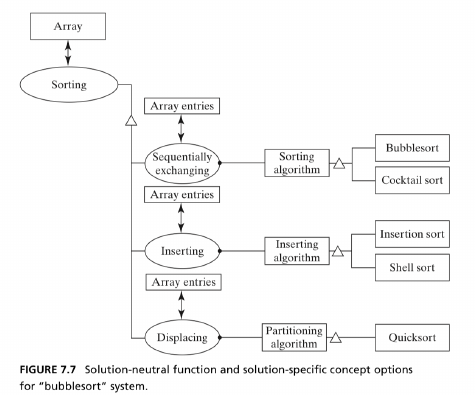

*Figure 7.7, 書籍 p.164*

物理製品だけでなく、software algorithm も operand-process-form の考え方で整理できることが分かる。

---

## 4.4 Transportation Service の例

本資料では Figure 7.8 を代表的な例として取り上げる。

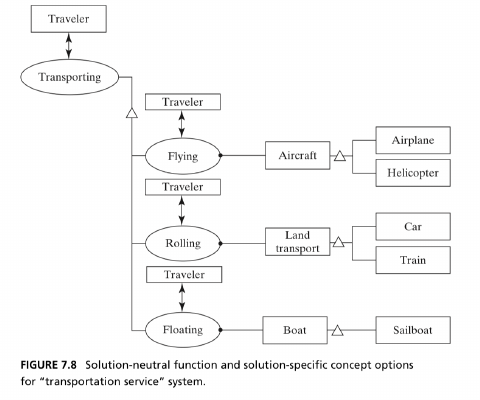

*Figure 7.8, 書籍 p.164*

Solution-neutral function は **Traveler / Transporting** であり、そこから、

- Flying
- Rolling
- Floating

という **specific process の候補**が考えられる。

さらに、

- Traveler / Flying → Aircraft → Airplane / Helicopter
- Traveler / Rolling → Land transport → Car / Train
- Traveler / Floating → Boat → Sailboat

のように form と対応付けることで、複数の Concept が構成される。

この例は、Solution-Neutral Function を定義してから specific process と form の候補を展開することで、**より広い concept space を探索しやすくなる**ことを示している。

---

## 4.5 Home Network の例

Figure 7.9 では、利用者の intent である **Book / Buying online** から具体的な接続方式を考えている。

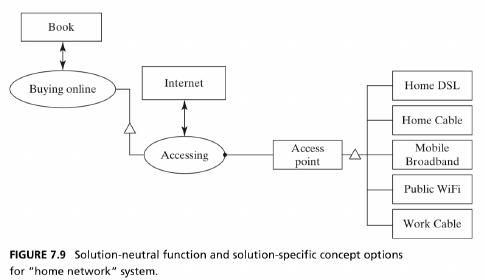

*Figure 7.9, 書籍 p.165*

ここでは、Internet / Accessing という specific function に対して、Home DSL、Home Cable、Mobile Broadband、Public WiFi、Work Cable などの form が候補となる。

重要なのは、設計の出発点が「DSLを作る」ではなく、**book を online で buying するという beneficiary の intent** であることである。

---

# 5. Broader Concepts and Hierarchy

## 5.1 Intent と Concept の階層

「どのレベルから設計を始めるべきか」という問題に唯一の正解はない。

Figure 7.10 では、Traveler が flying するという specific function より上位に、さらに複数の intent が存在することが示されている。

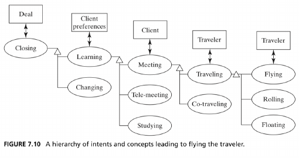

*Figure 7.10, 書籍 p.165*

例えば、

- Deal を close する
- Client preferences を learn する
- Client と meet する
- Traveler が travel する
- Traveler が fly する

という階層が考えられる。

この図の重要なポイントは、**あるレベルの specific function は、次のレベルでは solution-neutral function になる**ということである。

例えば「Traveling」は、上位の「Meeting」から見ればより具体的な function だが、さらに下位の交通方式を考えるときには solution-neutral function となる。

原文では、architect にとって **少なくとも一つか二つ上の intent hierarchy を理解しておくことが非常に有用**だとしている。

---

## 5.2 Home Network の Intent Hierarchy

Figure 7.11 では Home Network についても同様の階層が示されている。

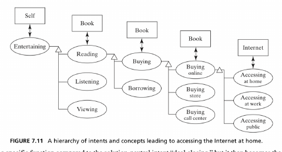

*Figure 7.11, 書籍 p.166*

代表的な経路は、概ね次のように表せる。

**Entertaining → Reading → Buying → Buying online → Accessing at home**

ただし、Figure 7.11 は一本道ではなく、各レベルに次のような alternative concepts がある。

- Reading に対する Listening / Viewing
- Buying に対する Borrowing
- Buying online に対する Buying in store / Buying through a call center
- Accessing at home に対する Accessing at work / Accessing in public

このように上位 intent と各階層の分岐を理解することで、例えば electronic book を販売するなど、別の選択肢が見える可能性がある。

---

# 6. Integrated Concepts

## 6.1 Rich process を internal processes へ展開する

Concept の **process 部分が意味の豊かな（rich）process** である場合、その process を複数の internal processes へ展開できる。

Transportation では、Concept の process 部分である transporting を展開すると、少なくとも、

- **Lifting**: 重力に対抗する
- **Propelling**: 抵抗に対抗して前進する
- **Guiding**: 進行方向を制御する

といった internal processes を考えられる。

各 internal process について、specific operand、specific process、instrument / form を定めて得られる部分的な Concept が **concept fragment** である。これらを組み合わせて、より詳細な **Integrated Concept** を構成できる。

ただし、これはすべての Concept に対して必須の工程ではない。選択した Concept の process が十分に rich で、内部機能へ展開することが有用な場合に行う。

---

## 6.2 Morphological Matrix

Concept fragments を整理・組み合わせるため、本章では **morphological matrix** を用いる。

Table 7.6 では、Transportation の3つの internal processes と、それぞれの instrument 候補を整理している。

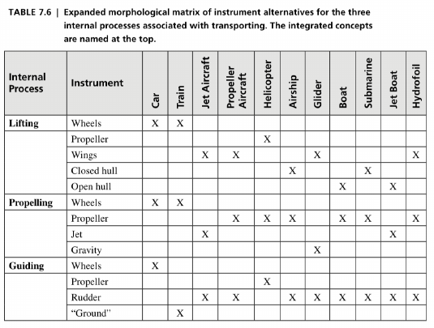

*Table 7.6, 書籍 p.167*

例えば Car は、Lifting / Propelling / Guiding のそれぞれに Wheels が関与する組合せとして表される。一方、Aircraft や Helicopter では別の instrument の組合せになる。

### Morphological Matrix の意味

Morphological Matrix を使うことで、

1. internal process ごとに instrument / form の候補を列挙する
2. それらを組み合わせて concept fragments の構成を比較する
3. Integrated Concept の候補を整理する

ことができる。

実際の Integrated Concept は、**必ずしも「一つの内部機能につき一つの form」を厳密に割り当てる構成にはならない**。例えば Home Network では、network management を gateway、switch、wireless access point が分担したり、複数の user devices を一つの案に含めたりする。原文では、このような柔軟な組合せを扱いつつ、計算機による探索を行う場合にはより厳密な表現が必要になることも示唆されている。

---

# 7. Home Network の Integrated Concept

Home Network でも同様に、システムを複数の内部機能へ分解する。

Table 7.7 では、主に次の function について **General Form / Specific Form** の候補を整理している。

- Connecting local network and ISP
- Modulating ISP carrier signal
- Managing data on local network
- Connecting user devices and local network
- Interacting with user

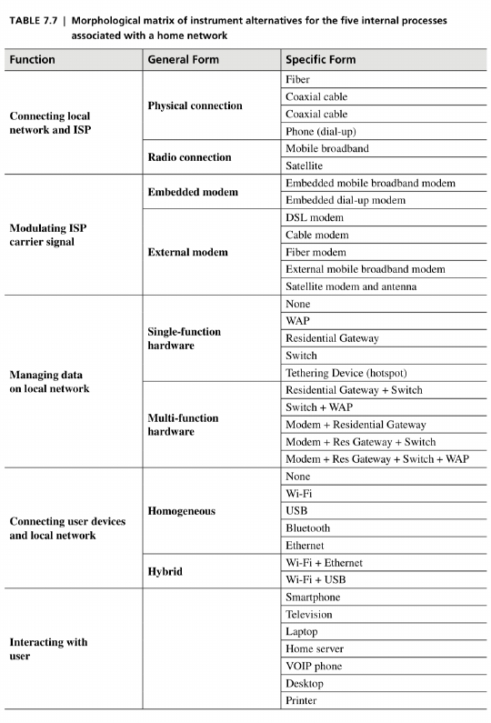

*Table 7.7, 書籍 p.169*

候補には、例えば、

- Fiber / Coaxial cable / Mobile broadband
- DSL modem / Cable modem / Fiber modem
- Gateway / Switch / Wireless access point
- Wi-Fi / USB / Bluetooth / Ethernet
- Smartphone / Television / Laptop / Desktop / Printer

などが含まれる。

これらの concept fragments を組み合わせることで、複数の Integrated Concept を構成できる。

---

## 7.1 Home Network の Integrated Concept の例

Figure 7.12 は一つの Home Network の Integrated Concept を示している。

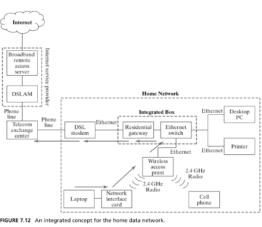

*Figure 7.12, 書籍 p.170*

この例では、DSL modem、Residential gateway、Ethernet switch、Wireless access point、Laptop / Desktop PC / Printer / Cell phone などの form が組み合わされている。

Table 7.8 では、Home Network の Integrated Concept を3案比較している。

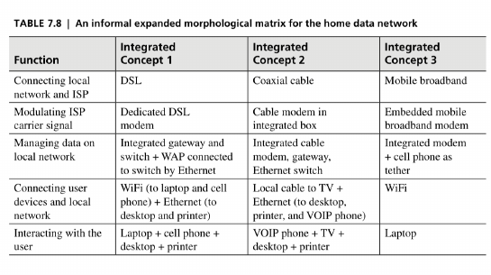

*Table 7.8, 書籍 p.170*

ここまで来ると、単に **Internet / Accessing** と表す高水準の specific function よりも、かなり具体的な system structure に近づいている。

---

# 8. Concepts of Operations and Services

## 8.1 Concept だけでは分からないこと

Integrated Concept を定義すると、システムの主要な form とその接続関係は分かる。

しかし、静的な構成図だけでは、**システムが実際にどのような順序で operation を行うのか**までは十分に表せない。

例えば Home Network の Figure 7.12 から、modem、gateway、switch、access point の存在は分かるが、Laptop から Internet へ data を送る際に、具体的にどのような operation が発生するかは別途説明する必要がある。

このために使われるのが **Concept of Operations（ConOps、運用構想）** である。

---

## 8.2 Concept of Operations とは

Concept of Operations は、**システムが実際にどのように operational に振る舞うかを conceptual level で表したもの**である。

Function が「システムに何ができるか」を表す比較的 quasi-static な見方であるのに対し、operation は primary function の提供に至る一連の行為を表し、function よりも広い概念である。

ConOps と詳細な operation sequence の関係は、system concept と system architecture の関係に対応する。ConOps は、**誰が、いつ、何と協調してシステムを運用するか**を含め、システムがどのように「動くか」を概略的に示す。

Home Network なら例えば、

- Laptop から ISP へ data を送る
- ISP から Laptop へ data を送る
- Local network 内の data を管理する

といった operation を考える。これらの operation は、必ずしも直列に行われるのではなく、同時に進行する場合がある。

---

## 8.3 Aircraft の ConOps と Air Transportation Service

本章では Figure 7.13 で、**Aircraft を中心とした Concept of Operations** と、**air transportation service の利用者中心の流れ**を並べて扱っている。

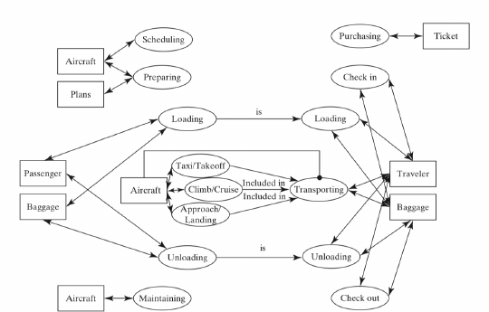

*Figure 7.13, 書籍 p.172*

### Aircraft 側の Concept of Operations

Aircraft 自身に対して行われる operation として、概ね次が含まれる。

- Scheduling of aircraft and crews
- Preparing / flight planning
- Loading
- Taxi / Takeoff
- Climb / Cruise
- Approach / Landing
- Unloading
- Maintaining

この operational view では、Aircraft 自身が scheduling、loading、flying、maintaining などの対象となるため、**Aircraft が operand** として扱われる。

### Air Transportation Service 側の利用者中心の流れ

利用者が air transportation service を受ける流れとしては、概ね次が含まれる。

- Trip planning
- Purchasing a ticket
- Check-in and checking baggage
- Loading
- Transporting
- Unloading
- Check-out

こちらでは **Traveler が operand** であり、Aircraft は Traveler を transport するための **instrument** として扱われる。

したがって、同じ Aircraft でも、**どの operational view / service view からモデル化するかによって役割が変化する**。

---

## 8.4 Good と Service

原文では、enterprise が **instrument を移転する場合を good**、**function を提供する場合を service** と説明している。

- Aircraft manufacturer は、Aircraft という **good** を販売する
- Airline は、transportation という **function / service** を提供する

このため、service についても system と同様に architecture を考えることができる。

---

# 9. Chapter 7 全体の流れ

本章の設計プロセスをまとめると、次のように整理できる。

1. **Primary beneficiary の Need / Intent を理解する**
2. 解決策を含まない **Solution-Neutral Function** を定義する
3. operand / process を具体化し、form と対応付けて **Concept** を生成する
4. 一つに固定せず、複数の **Concept options** を探索・整理する
5. 選択した Concept の process が rich である場合は、必要に応じて **internal processes** へ展開する
6. 各 internal process について **Concept Fragment** を考える
7. 必要に応じて Morphological Matrix 等を用い、fragments を組み合わせて **Integrated Concept** を構成する
8. 実際の operational sequence を **Concept of Operations（ConOps）** として整理する
9. 選択した Concept と ConOps をもとに、次章で **Architecture** を設計する

---

# 10. この章の最重要メッセージ

第7章の中心的な主張は、次のようにまとめられる。

**要求からいきなり具体的な製品・技術を選ぶのではなく、まず解決方法から独立した function を定義し、その後に複数の concept options を生成・比較しながら architecture へ進む。**

例えば transportation であれば、最初から「Airplane を作る」と考えるのではなく、まず **Traveler の location を変更する / Traveler を transport する**という solution-neutral な intent を考える。

そのうえで、Flying、Rolling、Floating などの **specific process 候補**を考え、それぞれを Aircraft / Land transport / Boat、さらに Airplane / Train / Car / Sailboat などの form と対応付けて、複数の Concept を構成する。

この一段階を挟むことで、最初に思いついた solution へ固定されるリスクを減らし、より広い concept space を探索しやすくなる。

さらに、選択した Concept の process が rich であれば、必要に応じて internal processes と concept fragments へ展開して Integrated Concept を構成し、ConOps によって実際の運用を記述する。これらが次章の Architecture 設計につながる。

---

# 11. 発表時に特に使いやすい図表

10-15分程度の輪読発表であれば、すべての図表を説明する必要はない。特に次の6点を使うと、章全体の流れを説明しやすい。

| 順番 | 図表 | 説明する内容 |
|---|---|---|
| 1 | Figure 7.1 | Solution-Neutral Function の考え方 |
| 2 | Figure 7.3 | Concept と Architecture の違い |
| 3 | Figure 7.8 | specific process と form を組み合わせた Concept options |
| 4 | Figure 7.10 | Intent / Concept の階層 |
| 5 | Table 7.6 | Concept Fragment と Morphological Matrix |
| 6 | Figure 7.13 | Aircraft の ConOps と Service view の違い |

この6枚を、

**Solution-Neutral Function → Concept options → （必要に応じて）Integrated Concept → Concept of Operations → Architecture**

という一本のストーリーに沿って説明すると、本章の要点を伝えやすい。

---

# 12. 原文参照上の注意

アップロードされたPDFは書籍 p.172 の Section 7.6 Summary の途中で終了しており、Chapter 7 の末尾全文は収録されていない。

また、収録範囲内には原文側の参照・表記の不整合と考えられる箇所がある。

- p.171 の Home Network の送信データに関する説明では `Figure 7.9` と記されているが、内容上は Figure 7.12 を指していると考えられる。
- p.168 本文と Table 7.8 では、Integrated Concept 2 の VOIP phone の接続方式について記述が一致していない。

輪読時に該当箇所を参照する場合は、この点に注意する。
